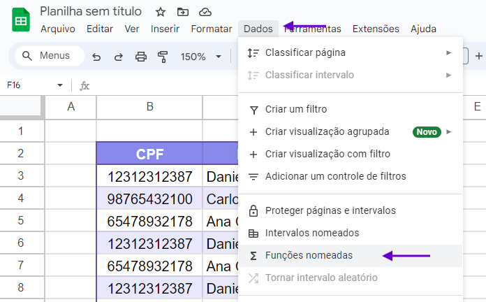
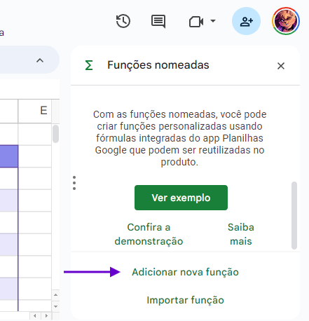
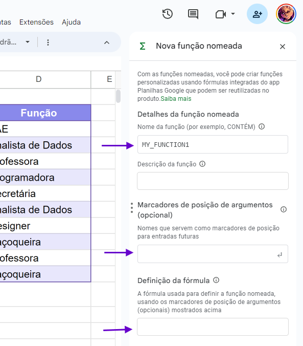
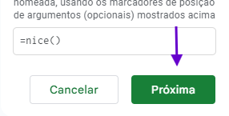

# Fórmulas customizadas

O Google Sheets possui duas formas para criar fórmulas customizadas nas suas planilhas: **Funções nomeadas** e **Funções no Apps Script**. Depois de instalar uma fórmula customizada, você pode chamar ela na sua planilha como qualquer fórmula normal, como `=SUAFORMULA(A2)`.

Neste site você pode encontrar algumas fórmulas úteis no dia-a-dia, e abaixo você verá como instalar elas na sua planilha.

> **Índice:**
> 
> 1. [Funções nomeadas](#funções-nomeadas) 
> 1.1. [Como instalar](#como-instalar) 
> 2. [Funções no Apps Script](#funções-no-apps-script) 
> 2.1 [Como instalar](#como-instalar-1) 
> 3. [Links de referência](#links-de-referência)

## Funções nomeadas

Não é incomum algumas fórmulas no Google Sheets ficarem estupidamente grandes. Um exemplo neste próprio documento é a [CPFCHECK()](../formulas/cpfcheck/main.md), fórmula matemática para calcular o dígito verificador do CPF, mas que é _enorme_ e envolve referenciar a mesma célula dúzias de vezes.

Para estes casos, o Google Sheets permite criar _funções nomeadas_, que é um jeito de "apelidar" essa fórmula pra algo mais lembrável e reutilizável na sua planilha.

Para saber mais, [leia este artigo do suporte do Google.](https://support.google.com/docs/answer/12504534)

### Como instalar

1. Clique em **Dados** e em **Funções nomeadas**.

  

2. Selecione **Adicionar nova função**.

  

3. As funções nomeadas normalmente precisam de 3 campos: **Nome da função**, **Marcadores de posição de argumentos** e **Definição da fórmula**. 

  

Neste site, as fórmulas também estão organizadas pelos mesmos campos, portanto basta copiar e colar.

<b>Nota</b>

Aperte "enter" para cada marcador de posição que você colar.

4. Aperte **Próxima** e em **Criar**.

## Funções no Apps Script

**Google Apps Script** é um ambiente que permite desenvolver aplicações simples em Javascript que rodam nos servidores do Google e integram ferramentas da GSuite e outras externas que possuam APIs públicas.

No Google Sheets, o Apps Script também pode ser usado para criar fórmulas customizadas que possam se aproveitar da capacidade do Javascript de processar dados de forma mais complexa, ou de conexões com os serviços do Google.

Para saber mais, [leia este artigo no suporte do Google.](https://developers.google.com/apps-script/guides/sheets/functions?hl=pt-br)

### Como instalar

1. Clique em **Extensões** e em **Apps Script**.

2. Copie o código da função customizada, cole na última linha do documento e salve.

## Links de referência

- [Funções personalizadas no Planilhas Google - Apps Script](https://developers.google.com/apps-script/guides/sheets/functions?hl=pt-br)

- [Create & use named functions - Google Docs Editors Help](https://support.google.com/docs/answer/12504534)