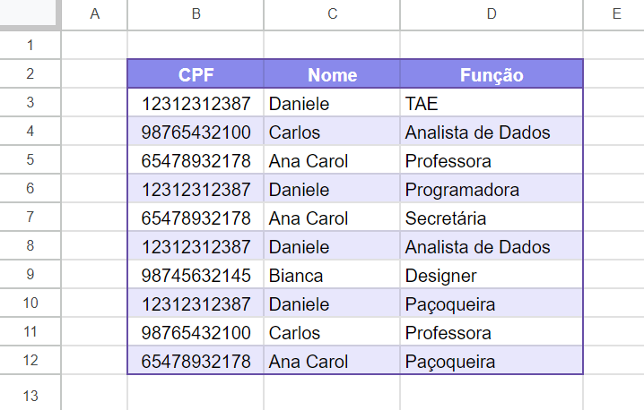

# =PROCTUDO(informacao_a_pesquisar; coluna_a_pesquisar; coluna_a_retornar)

**Descrição:** Fórmula com função parecida do PROCV: ela procura um valor na planilha e retorna outro valor de outra coluna; mas caso o valor procurado apareça mais de uma vez, retorna todos os valores correlacionados, separados por ponto-e-vírgula.

Por exemplo, veja a tabela a seguir:



Neste cenário, caso se deseje obter todas as funções de um CPF, utilizar o PROCV não resolveria, já que só me retornaria a primeira referência do CPF.

Para isso, utilize o PROCTUDO da seguinte maneira:

```
              Coluna onde o CPF está
                        ⬇
=PROCTUDO(12312312387; B:B; D:D)
               ⬆             ⬆
             CPF a      Coluna onde
            procurar   a função está
```

Lembre-se que as duas colunas referenciadas **precisam ser** do mesmo tamanho.

{{#include ../../../../templates/cafe.md}}

## Versão para uso como função nomeada

**Nome da função:**
```
PROCTUDO
```
**Marcadores de posição de argumentos::**
```
informacao_a_pesquisar
```
```
coluna_a_pesquisar
```
```
coluna_a_retornar
```

**Definição da fórmula:**
```
=BYROW(informacao_a_pesquisar;LAMBDA(λ;JOIN("; "; UNIQUE(FILTER(coluna_a_retornar;coluna_a_pesquisar = λ)))))
```