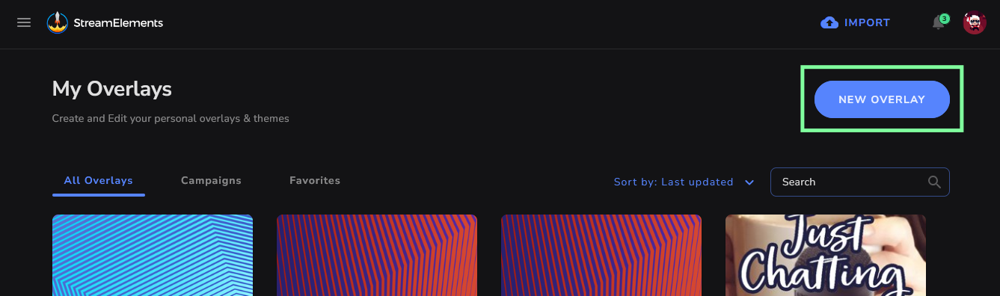
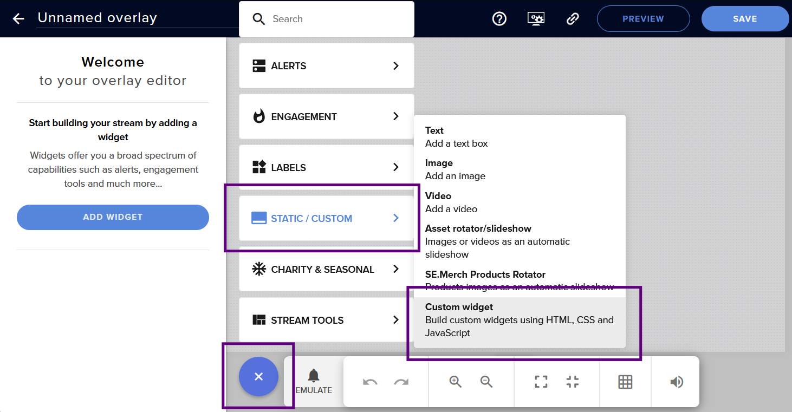
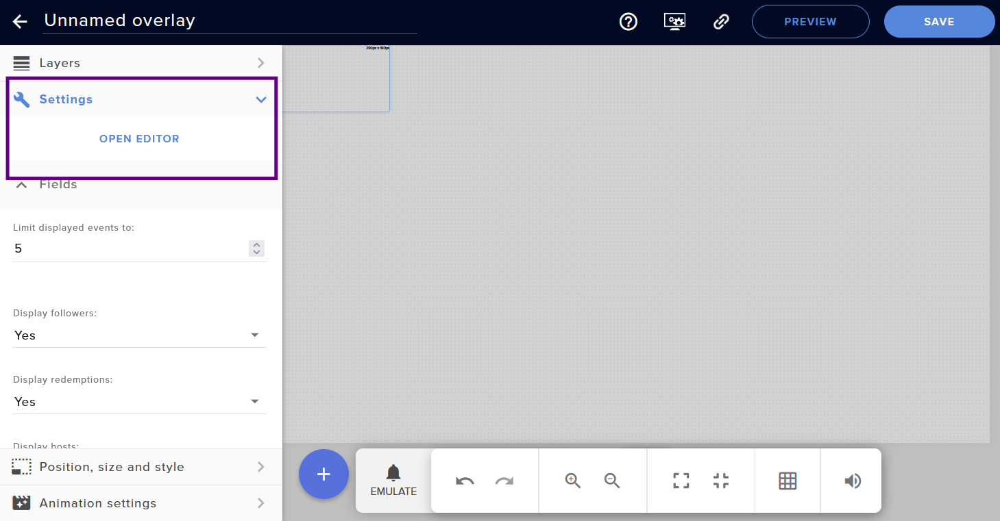
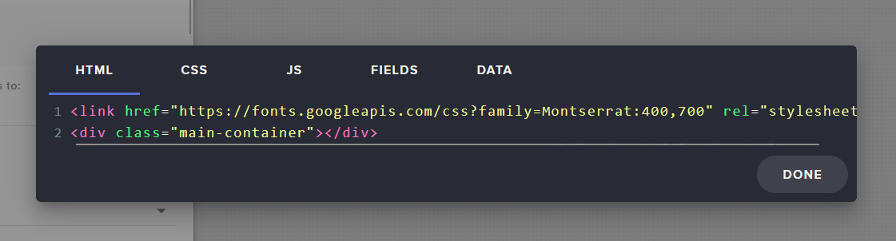

# Instalando Widgets customizados no StreamElements

Caso você não conheça, [StreamElements](https://streamelements.com/) é uma ferramenta com diversas funcionalidades para livestreams, e dentre elas, [criar overlays e widgets personalizados](https://docs.streamelements.com/overlays/getting-started) que podem ou não interagir com os espectadores.

Compartilho aqui alguns dos meus miniprojetos para que você possa usar na sua live :3

## Como instalar um widget

1. Acesse [https://streamelements.com/dashboard/overlays](https://streamelements.com/dashboard/overlays) e crie um novo overlay, caso você ainda não tenha criado um, clicando em "New overlay"

  

2. Clique em "➕" > Static/Custom > Custom Widget.

  

3. Vá em "🔧 Settings" e em "Open Editor".

  

4. Será aberta uma janela com 5 abas: **HTML**, **CSS**, **JS**, **Fields** e **Data**.

Neste site, o código dos widgets também está organizado pelos mesmos nomes, portanto basta copiar e colar o código nessas abas. Se alguma das abas não foi especificada na sua página, deixe ela em branco. Depois, só clicar em "Done".