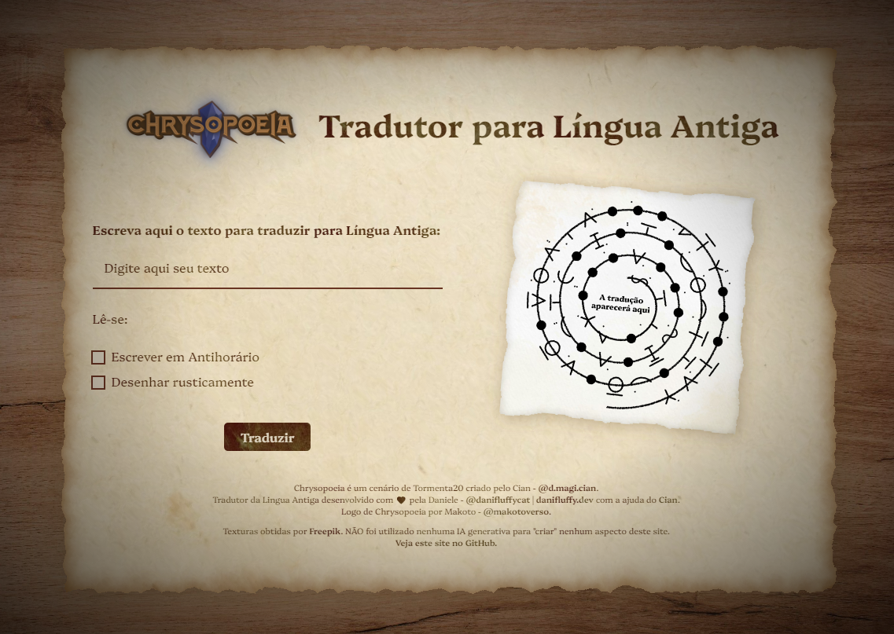

<h1 align="center"><a href="https://linguaantiga.danifluffy.dev">Tradutor de Língua Antiga RPG Chrysopoeia</a></h1>

**Língua Antiga** é um idioma criado pelo [Cian](https://instagram.com/d.magi.cian) no seu cenário de Tormenta20, **Chrysopoeia**. Como fã da sua obra e da [campanha de Chrysopoeia no canal "Pra Quem Gosta"](https://www.youtube.com/playlist?list=PLnbFq63ncllDlOGyZTvnm1FbgRFc8HEuR), eu quis criar um sistema de tradução e escrita da Língua Antiga _for fun_, por que ia ficar legal e, bem... [este foi o resultado](https://linguaantiga.danifluffy.dev) (:

Este projeto tem alguns aspectos que eu gostei muito de explorar, como estudo do HTML Canva para gerar imagens localmente, manipulação de strings para traduzir a gramática do idioma, entre outros. Entretanto, essas são coisas que irei documentar mais no futuro ^^

## Créditos

- _Língua Antiga_ é uma criação original do Cian - [@d.magi.cian](https://instagram.com/d.magi.cian)
- _Tradutor para Lingua Antiga_ foi desenvolvido pela Daniele - [@danifluffycat](https://instagram.com/danifluffycat) | [danifluffy.dev](https://danifluffy.dev) com ajuda do [Cian](https://instagram.com/d.magi.cian).
- Logo de _Chrysopoeia_ por Makoto - [@makotoverso](https://www.instagram.com/makotoverso/)
- Texturas utilizadas no site por [Freepik](https://br.freepik.com/)

Não foi utilizado nenhuma IA generativa para "criar" nenhum aspecto deste projeto.