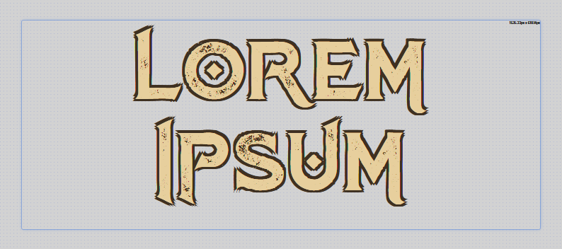
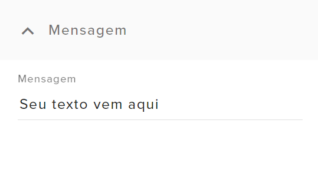
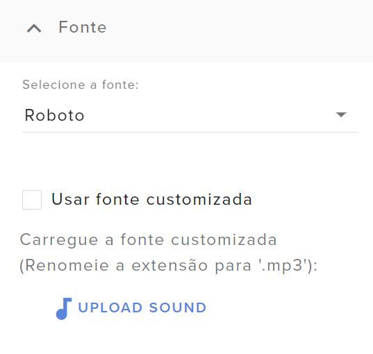
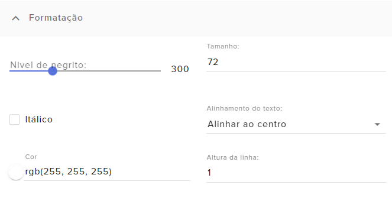
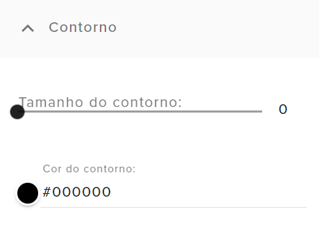

# Texto+



Este widget serve para criar uma caixa de texto customizada, com mais funções de personalização que a nativa do StreamElements, como possibilidade de adicionar fontes customizadas e contorno nas letras.  
Agradecimentos especiais para a Dabs, do [Pra Quem Gosta](https://www.youtube.com/c/PraQuemGosta), por me permitir publicar este widget que eu fiz pra uso dela ^^  

{{#include ../../../../_sysfiles/templates/cafe.md}}


> **Índice:**  
> - [Guia de configuração](#guia-de-configuração)
> - [Códigos](#códigos)


## Guia de configuração

Antes de começar, se você não sabe instalar um widget no StreamElements, [veja aqui como instalar.](../instrucoes/main.md)


### Mensagem

<p align="center"></p>

Nesse campo você vai digitar o texto que vai aparecer na tela. Entretanto, uma das funções do Texto+ é permitir alterar esse texto temporariamente direto pelo OBS Studio, pela função de _interagir_. Assim que o overlay for atualizado, o texto voltará ao conteúdo original.

<p align="center"><video src="./guia2.webm" controls></video></p> 

Um exemplo de caso de uso seria:  
Caso você receba convidados com frequência no seu canal, você pode alterar rapidamente o nome que está no overlay, sem logar no StreamElements. 


### Fonte

<p align="center"></p>

Aqui você escolhe qual a fonte do texto. Caso você tenha um arquivo de fonte baixado e queira utilizar, renomeie a extensão do arquivo para ".mp3" e carregue como se fosse um áudio.

<p align="center"><video src="./guia4.webm" controls></video></p>


### Formatação

<p align="center"></p>

Aqui você configura a formatação do seu texto, como o nível do negrito, tamanho, alinhamento, cor, entre outros.


### Contorno

<p align="center"></p>

Aqui você configura se seu texto terá algum contorno em volta, e a cor. Não recomendo utilizar contornos muito grandes, pois as bordas tendem a ficar levemente quebradas.


## Códigos

[Veja aqui como instalar um widget customizado no StreamElements.](../instrucoes/main.md)

### HTML
```html
{{#include SE-index.html}}
```

### CSS
```css
{{#include SE-style.css}}
```

### Javascript
```javascript
{{#include SE-script.js}}
```

### Fields
```json
{{#include SE-config.json}}
```

{{#include ../../../../_sysfiles/templates/cafe.md}}