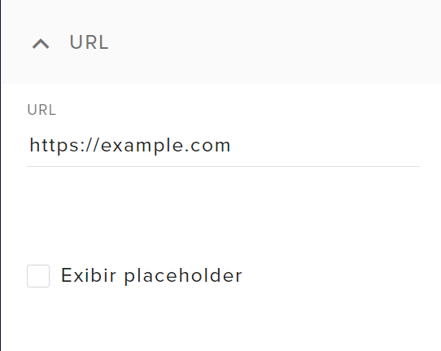
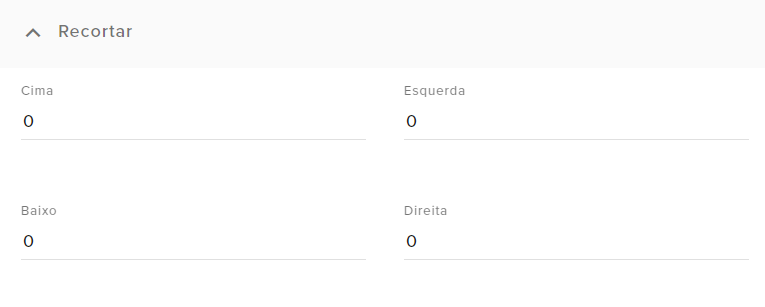

# Fonte da web


Este widget adiciona um site dentro do overlay do StreamElements, desde que ele tenha suporte para incorporação. No exemplo acima, este widget é usado para inserir uma webcam do [OBS.ninja](https://vdo.ninja) diretamente no overlay.

Agradecimentos especiais para a Dabs, do [Pra Quem Gosta](https://www.youtube.com/c/PraQuemGosta), por me permitir publicar este widget que eu fiz pra uso dela ^^

{{#include ../../_sysfiles/templates/cafe.md}}


> **Índice:**  
> - [Guia de configuração](#guia-de-configuração)
> - [Códigos](#códigos)


## Guia de configuração

Antes de começar, se você não sabe instalar um widget no StreamElements, [veja aqui como instalar.](../instrucoes/main.md)


### URL

<p align="center"></p>

Aqui você irá definir qual site será exibido no widget.  

<div class="note"><b>Vale o aviso: </b>

Para exibir um site por esse widget, o site em questão _precisa permitir incorporação_. Normalmente os sites que permitem tem uma opção chamada _"Embed"_ ou _"Incorporar"_ próxima a alguma opção de compartilhamento.  
Isso não é uma limitação do widget ou do StreamElements, mas é parte das normas de segurança de iFrame, e não conheço nenhuma forma de contornar isso.  
Se o site que você deseja inserir não suportar incorporação, este widget não carregará. Nesse caso, você deve inseri-lo diretamente como uma fonte de navegador no OBS Studio.

</div>


### Recortar

<p align="center"></p>

Como pode ser que o site que você irá mostrar tenha mais informações que o necessário, aqui você pode cortar as bordas para focar no elemento importante.


## Códigos

[Veja aqui como instalar um widget customizado no StreamElements.](../instrucoes/main.md)

### HTML
```html
{{#include SE-index.html}}
```

### CSS
```css
{{#include SE-style.css}}
```

### JS
```javascript
// Vazio
```

### Fields
```json
{{#include SE-config.json}}
```

{{#include ../../_sysfiles/templates/cafe.md}}