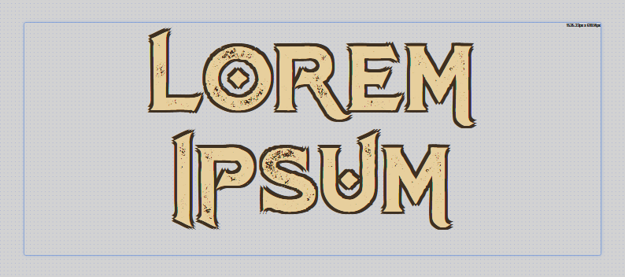
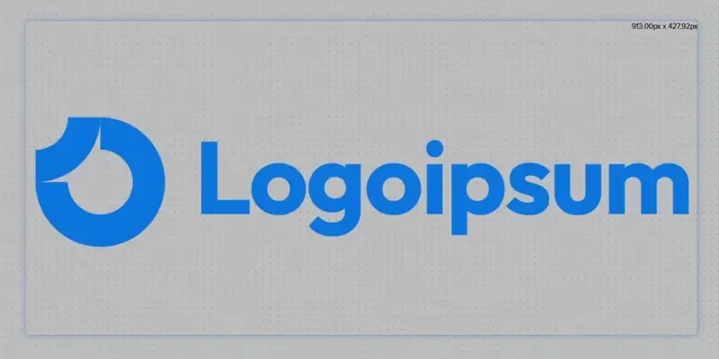

# Ferramentas para Streamelements

Caso você não conheça, [StreamElements](https://streamelements.com/) é uma ferramenta com diversas funcionalidades para livestreams, e dentre elas, [criar overlays e widgets personalizados](https://docs.streamelements.com/overlays/getting-started) que podem ou não interagir com os espectadores.

Compartilho aqui alguns dos meus miniprojetos para que você possa usar na sua live :3

## [Como instalar um widget](./instrucoes/main.md)
Nunca usou um widget customizado? Comece por aqui! [Leia mais.](./instrucoes/main.md)

## [Texto+](./custom-text/main.md)

Este widget serve para criar uma caixa de texto customizada, com mais funções de personalização que a nativa do StreamElements, como possibilidade de adicionar fontes customizadas e contorno nas letras. [Leia mais.](./custom-text/main.md)

## [Fonte da web](./iframe/main.md)

Este widget adiciona um site dentro do overlay do StreamElements, desde que ele tenha suporte para incorporação. [Leia mais.](./iframe/main.md)

## [Slideshow](./slideshow/main.md)

Este widget serve para adicionar várias imagens que se alternam num tempo especificado. É bem útil para colocar logos se alternando no canto do overlay. [Leia mais.](./slideshow/main.md)

## [Soundboard](./soundboard/main.md)
Este widget aciona um áudio quando um espectador chama um comando. Widget em desenvolvimento. [Leia mais.](./soundboard/main.md)
