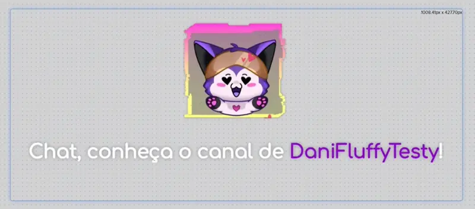
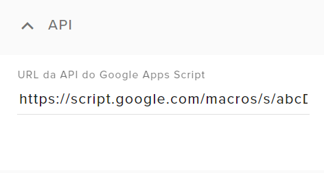
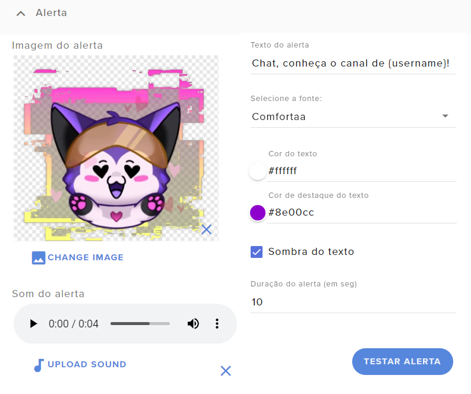
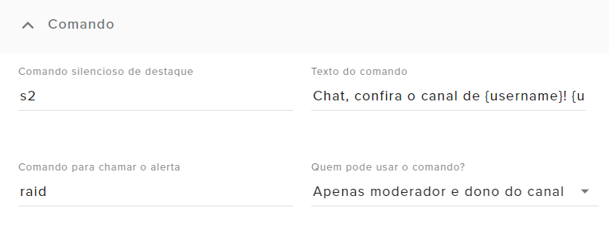

# Shoutout para YouTube


<sup>Arte original: [Cosmic Wolf](https://www.cosmicwolf.net/)</sup>


<div class="warning"><b>Este código ainda está em fase de testes.</b>

Sinta-se á vontade para testar, mas esteja ciente que podem conter bugs. _Use por sua conta e risco._
</div>


Use um comando de destaque para chamar atenção dos espectadores para uma pessoa importante no seu chat, como um _raider_, e convidar seu chat para conhecer o canal da pessoa!

Agradecimentos especiais para a [Cosmic Wolf](https://www.youtube.com/@CosmicWolf_Arts), por me permitir publicar este widget que eu fiz pra uso dela ^^  

{{#include ../../_sysfiles/templates/cafe.md}}


> **Índice:**  
> 1. [Introdução](#introdução)
> 1. [Instalando o script no Google Drive](#parte-1-instalando-o-script-no-google-drive)  
> 1. [Configurando o comando no Chatbot](#parte-2-configurando-o-comando-no-chatbot)
> 1. [Configurando o widget](#parte-3-configurando-o-widget)


## Introdução

Na Twitch, este comando é conhecido como _/shoutout_ ou _!s2_, e é bem mais simples de se implementar, já que envolve simplesmente criar um comando que escreve twitch.tv/usuárioMarcado. Esse método não é possível no YouTube, já que o nome que aparece no chat _não é_ seu nome de usuário. 

Sendo assim, eu desenvolvi uma abordagem diferente que usa os dados que um widget tem do chat para enviar o link do usuário destacado para o chat! Entretanto, este é um código mais complexo que um widget normal, e ele se divide em 3 partes:
- Um arquivo de script no seu Google Drive;
- Um comando no chatbot do StreamElements;
- Um widget do StreamElements que precisa estar ativo no seu OBS.


## Parte 1: Instalando o script no Google Drive

Abra o seu [Google Drive](https://drive.google.com/) e vá em **➕ Novo** > **Mais** > **Script do Google Apps**.  
Você pode criar esse script em qualquer pasta do seu Google Drive, desde não corra o risco de você deletá-lo por acidente. Vale inclusive renomear depois o arquivo para você não o perder :)

<p align="center"><video src="./tutorial1.webm" controls></video></p>

Cole o código abaixo na janela que se abrir:

```javascript
{{#include GAS-script.js}}
```

Clique em **Implantar** > **Nova implantação**.  
Na nova janela, clique em **⚙️** > **App da Web**.  
A opção **"Executar como"** deve estar marcada como **"Eu"**, e **"Quem pode acessar"** como **"Qualquer pessoa"**. Depois disso, clique em **Implantar**.

<p align="center"><video src="./tutorial2.webm" controls></video></p>

Copie o URL do App da Web e guarde temporariamente num Bloco de Notas; ele será importante nas próximas partes.


## Parte 2: Configurando o comando no Chatbot

Existem 2 comandos de destaques diferentes:
- Um silencioso, que apenas mostra a mensagem no chat; e
- Um que também mostra um alerta no widget.

No video do tutorial, vou utilizar **shoutout** como comando silencioso, e **raid** como comando de alerta, mas você pode personalizar para qual texto preferir, desde que você use a mesma configuração de comando no chatbot e no widget.

Acesse [https://streamelements.com/dashboard/bot/commands/custom](https://streamelements.com/dashboard/bot/commands/custom).

Clique em **Add new command**.

Em **Command name**, informe o nome do comando silencioso.

Em **Response type**, copie e cole o texto abaixo, substituindo [URL do Apps Script] pelo URL que você anotou na parte anterior.

```
${urlfetch [URL do Apps Script]?action=find&username=${1:}}
```

Vá em **Advanced settings** > **Command aliases** e informe o nome do comando de alerta.

E finalize clicando em **Activate command**.

<p align="center"><video src="./tutorial3.webm" controls></video></p>

Opcionalmente, você também pode definir o **User level**, caso queira restringir o uso do comando apenas para moderadores, por exemplo.


## Parte 3: Configurando o widget

Agora nós vamos instalar o widget no overlay. [Eu já fiz um tutorial](../instrucoes/main.md) ensinando a instalar um widget no StreamElements, que você pode ver [clicando aqui.](../instrucoes/main.md) Depois de instalado, entraremos diretamente na configuração do widget em si.

O código que você deve instalar é o seguinte:

### HTML
```html
{{#include SE-index.html}}
```

### CSS
```css
{{#include SE-style.css}}
```

### Javascript
```javascript
{{#include SE-script.js}}
```

### Fields
```json
{{#include SE-config.json}}
```

<br>

### Configuração "API"

<p align="center"></p>

Aqui você deve colar o URL que você anotou na parte 1 do tutorial.

### Configuração "Alerta"

<p align="center"></p>

Aqui você vai configurar como o alerta irá aparecer na sua live. Tem 2 pontos importantes para destacar:
1. Se você quiser inserir um video ao invés de uma imagem, sugiro converter para GIF com uma ferramenta como o [EzGif](https://ezgif.com).
1. Em **Texto do alerta** você deve escrever `{username}` onde irá aparecer o nome da pessoa destacada.

### Configuração "Comando"

<p align="center"></p>

Aqui você vai configurar como o comando irá responder no seu chat. Destaco uma configuração importante no **Texto do comando**: você deve escrever `{username}` onde irá aparecer o nome da pessoa destacada, e `{url}` onde irá aparecer o link do canal da pessoa.

<div class="important"><b>Lembre-se:</b>

Para o comando funcionar corretamente, o overlay com este widget **precisa** estar ativo no seu OBS, _mesmo para usar o comando silencioso_.
</div>

{{#include ../../_sysfiles/templates/cafe.md}}