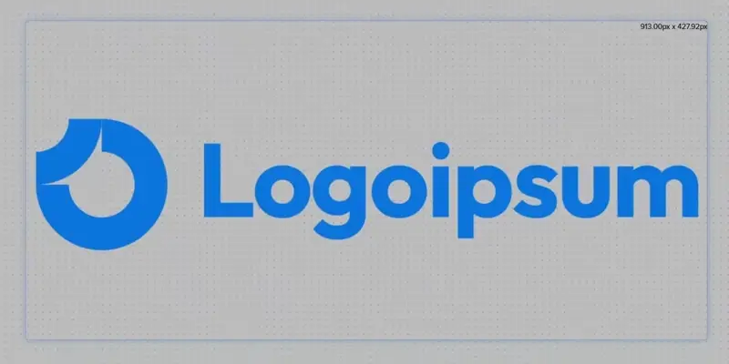
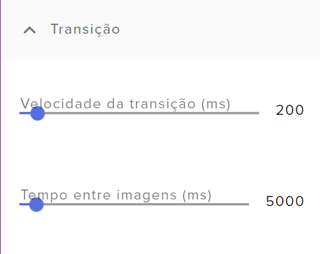
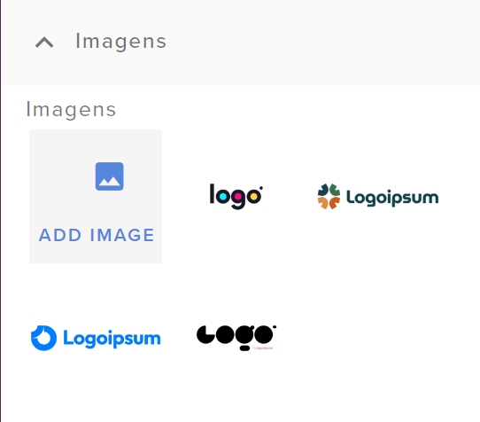

# Slideshow



Este widget serve para adicionar várias imagens que se alternam num tempo especificado. É bem útil para colocar logos se alternando no canto do overlay.

Agradecimentos especiais à Dabs, do [Pra Quem Gosta](https://www.youtube.com/c/PraQuemGosta), por me permitir publicar este widget que eu fiz pra uso dela ^^

{{#include ../../../../_sysfiles/templates/cafe.md}}


> **Índice:**  
> - [Guia de configuração](#guia-de-configuração)
> - [Códigos](#códigos)


## Guia de configuração

Antes de começar, se você não sabe instalar um widget no StreamElements, [veja aqui como instalar.](../instrucoes/main.md)


### Transição

<p align="center"></p>

Controla o tempo que vai levar na troca de cada imagem, e o tempo da transição entre as duas imagens.


### Imagens

<p align="center"></p>

Aqui você irá inserir todas as imagens que serão exibidas no widget. Se você quiser inserir um video, sugiro converter para GIF com uma ferramenta como o [EzGif](https://ezgif.com)


## Códigos

[Veja aqui como instalar um widget customizado no StreamElements.](../instrucoes/main.md)

### HTML
```html
{{#include SE-index.html}}
```

### CSS
```css
{{#include SE-style.css}}
```

### Javascript
```javascript
{{#include SE-script.js}}
```

### Fields
```json
{{#include SE-config.json}}
```